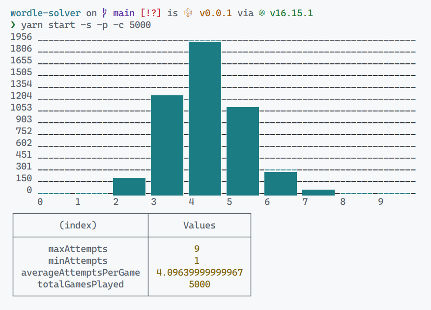

# wordle-exercise

This repo has code that when run (CLI), plays the **wordle** game by itself based on a 2300+ word list.

## How to run

Install -

1. NodeJS LTS
2. `yarn`

Then run the following commands:

```sh
git clone git@github.com:sushruth/wordle-player.git
cd wordle-player
yarn
yarn start
```

## Options

Here is what `yarn start -h` says:

```
Usage: wordle-player [options]

Options:
  -V, --version         output the version number
  -c, --count <number>  Number of games to play (default: "1")
  -p, --print-stats     Print stats about all the plays (default: false)
  -s, --silent          silent (default: false)
  -do, --debug-options  debug the CLI options (default: false)
  -h, --help            display help for command
```

## How does it look?


## Some stats about how (in)efficient this is

```jsonc
{
  "maxAttempts": 13, // game with max attempts
  "minAttempts": 2, // game with min attempts
  "averageAttemptsList": 5.899999999999877, // average attempts per game
  "totalGamesPlayed": 1000 // total games played
}
```

It also shows a graph of how many times the game was solved in a given number of attempts.



## Issues

### FIXED: The Yellow issue

Does not fully eliminate yellow tile reuse


### Not statistically sound yet -

It can take a while to solve sometimes


