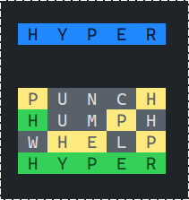
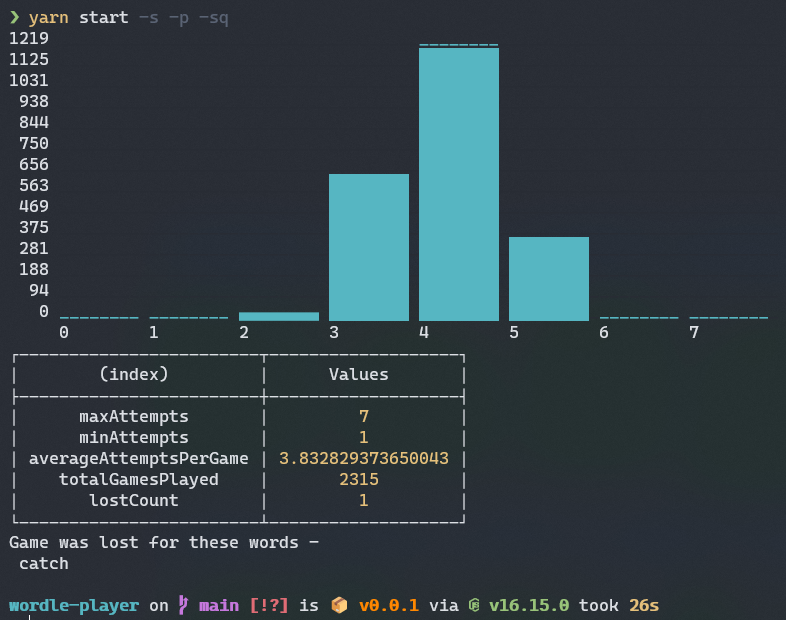
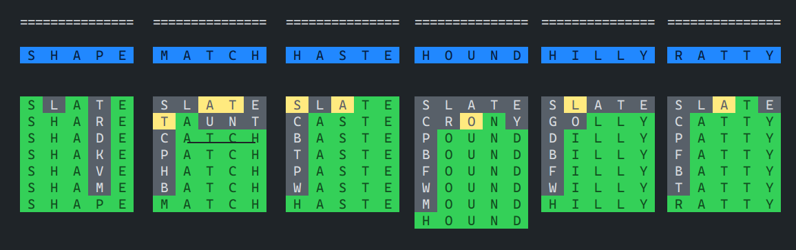

# wordle-exercise

This repo has code that when run (CLI), plays the **wordle** game by itself based on a 2300+ word list.

## How to run

Install -

1. NodeJS LTS
2. `yarn`

Then run the following commands:

```sh
git clone git@github.com:sushruth/wordle-player.git
cd wordle-player
yarn
yarn start
```

## Options

Here is what `yarn start -h` says:

```
Usage: yarn start [options]

Options:
  -V, --version         output the version number
  -c, --count <number>  Number of games to play (default: "1")
  -p, --print-stats     Print stats about all the plays (default: false)
  -s, --silent          does not print each game in the console when set to true (default: false)
  -sq, --sequential     runs through all words in the db sequentially once each (default: false)
  -do, --debug-options  debug the CLI options (default: false)
  -h, --help            display help for command
```

## How does it look?



## Some stats about how (in)efficient this is

```jsonc
{
  "maxAttempts": 13, // game with max attempts
  "minAttempts": 2, // game with min attempts
  "averageAttemptsList": 5.899999999999877, // average attempts per game
  "totalGamesPlayed": 1000 // total games played
}
```

It also shows a graph of how many times the game was solved in a given number of attempts.


## Issues

### FIXED: The Yellow issue

Does not fully eliminate yellow tile reuse


### Partially FIXED - Not statistically sound yet -

It can take a while to solve sometimes


the solution is way better for this word now -


## Updates

### 07/14/2022

I added a new guesser based on the old one. I now fail for only one word - "Catch". Very poetic.



Here it how it fails -


Tweaking it more now. Here is the scoring works now - (lps = letter-position-score of filtered word list)

```ts
let highestScore = 0;
for (const originalWord of wordList) {
  let word = originalWord.slice();
  let score = 0;
  let seenLetters = new Set<Letter>();
  for (let i = 0; i < word.length; i++) {
    const letter = word[i];

    if (greenPositionLetters[i]?.includes(letter)) {
      score -= 2;
    } else if (greenLetters.includes(letter)) {
      score -= 1;
    } else {
      let delta = lps[i][letter] || 0;
      if (seenLetters.has(letter)) {
        delta = delta - 2;
      }
      score += delta;
    }

    if (lpsLetters.includes(letter)) {
      score += 1;
    }

    seenLetters.add(letter);
  }

  if (highestScore <= score) {
    highestScore = score;
  }

  if (score) {
    scoreMap.set(originalWord, score);
  }
}
```

### 07/10/2022

Updated the next word guesser based on letter-position-frequency - Meaning that in each round, we filter the words based on current execution result and the filtered list of words is then ranked by a score.

To calculate this score, we first iterate through each word in the filtered list and count the number of times any letter appeared in a given position. That count becomes the positional score of that letter. After going through all the words in the list, we calculate the score for each word by taking the sum of all the positional scores for the letters in that word (except for the green letters).

Once we have a score for each word, we sort the word list by that score in descending order, and pick the first word in the list (which would denote the word with the highest score).

This brings the un-winnable (cannot solve within 6 tries) words from the list down to 15. These are the words for now -

```
jaunt,watch,homer,night,mound,stamp,joker,shape,haste,hilly,ratty,hound,match
```

Here is what they look like in execution -




My theory is that - as long as we have words sharing 4 letters in exact same positions, any ranked picking strategy will always have non-zero chance of losing since if the word to be guessed happens to be lowest ranked in any group of such words, it will be picked last and we could lose.
